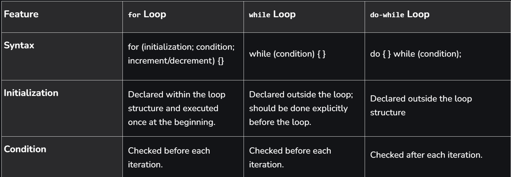

# JavaScript Data Types and Variables

```javascript
console.log("hello world");

// Data Types and Variables
var names = "ishwor acharya";
console.log(names);
```
## *JavaScript Data Types
// There are two types of data types in JavaScript: 


1. Primitive Data Types
// String, Number, BigInt, Boolean, Null, Undefined, and Symbol

 a.  Integer
```javascript
let a = 1;
console.log(typeof(a)); // Output: number
```
 b.  String
 ```javascript
let a = "ishwor";
console.log(typeof(a)); // Output: string
```
c. Boolean
```javascript
let a = true;
console.log(typeof(a)); // Output: boolean
```
d. Undefined
``` javascript
let a;
console.log(typeof(a)); // Output: undefined
```
e.  Null (In JavaScript, null represents "nothing", but its datatype is an object)
``` javascript
let a = null;
console.log(typeof(a)); // Output: object
```
f. Symbol (It means unique, even if the datatypes and the values are the same, if used symbol it differs from each other)
```javascript
let a, b;
a = "ishwor";
b = Symbol("ishwor");
console.log(a == b); // Output: false
```
g. BigInt (Prints more digits than an integer => 16 digits)
``` javascript
let a = BigInt(1);
console.log(a); // Output: 1n
```
2.  Non-primitive Data Types
// Objects, Arrays, and Functions


a.  Example of an Object
``` javascript
let person = {
    firstName: "Ishwor",
    lastName: "Acharya",
    age: 30
};
console.log(typeof(person)); // Output: object
```
b.  Example of an Array
``` javascript
let numbers = [1, 2, 3, 4, 5];
console.log(typeof(numbers)); // Output: object
```
c.  Example of a Function 
``` javascript
function greet() {
    console.log("Hello, world!");
}
console.log(typeof(greet)); // Output: function


```
## Difference between Object and Array
### Object 
  1. Key value paires
   ```javascript
    let a={
        "key":"value",
        "key":"value",
        "key":"value"
    }
   ```
   2. Can hold different datatypes
   3. syntax ={}
### Array
  
1. Ordered collections of values
 ```javascript
 let a=[1,2,3,4]
 let b=["Ishwor","Yaman","nabin"]
 ```
2. syntax =[]


##  * var, let , const
### var (redeclaration and reassign)
/*
```javascript
var name="Ishwor"
console.log(name);
name="";
var name="kajal";
console.log(name);

*/
```
### let (no redeclaration but reassign )
/*
``` javascript
let name="Ishwor";
 name=2;
 console.log(name);
 */
```

### const (no redeclaration and reassign)

```javascript
const a=2;
a=3;//not possible
console.log(a);
```

## Scoping (Block scoping and global scoping )
1. Block scoping =>run only inside the condition 
2. Global scoping => globally run until reassign 

### var (global scoping )
/*
``` javascript
var a=2;
if(true){
    var a=3;
    console.log(a);// Output: 3
}
console.log(a);// Output: 3
*/
```
### let and const (block scoping)
``` javascript
let a=2;
if(true){
    let a=3;
    console.log(a);// Output: 3
}
console.log(a);// Output: 2
```
# Operators
``` javascript
/*
The Assignment Operator = assigns values

The Addition Operator + adds values

The Multiplication Operator * multiplies values

The Comparison Operator > compares values
*/

```
## 1. Arithemetic Operators
/*
```javascript
let a,b;
a=2;
b=3;
console.log(a+b);//5
console.log(a-b);//-1
console.log(a*b);//6
console.log(a/b);//0.6666666666666666
console.log(a%b);//2
console.log(a++);//2
console.log(++a);//3
console.log(a--);//3
console.log(a);//2
console.log(--a);//1
console.log(a**a);//1*1=1

*/
```
## 2. Assignment Operators (=,+=,-=)
/*
``` javascript
let a,b;
a=3,b=4;
console.log(a+=a);// a=a+a;
console.log(a-=a);//a=a-a;
*/
```
## 3. Comparision Operators (== , ===, >, <, )
/*
``` javascript
let a,b,c;
a=2,b=3,c="2";
console.log(a==b);//false 
console.log(a===c);//false ( also checks the datatype)
console.log(a<b);//true;

*/
```
## 4. Logical Operators  (&& || ! )
/*
``` javascript
let z=true;
let x=false;
console.log(z && z);//true 
console.log(z && x);//false
console.log(z || x);//true
console.log(!z);//false
console.log(!x);//true
*/
```
## 5. Ternary Operators
/*
``` javascript
console.log((2>1)?'it is true':'its false');
// is 2 greater than 1  ? if true return true  else return false
*/
```
## 6. Conditional Operators ( if else elseif switch)

###  a. if else else if 
 syntax
 /*
 ``` javascript
if (condition1) {
  //  block of code to be executed if condition1 is true
} else if (condition2) {
  //  block of code to be executed if the condition1 is false and condition2 is true
} else {
  //  block of code to be executed if the condition1 is false and condition2 is false
}
  */
 ``` 
 Example

/*
 ``` javascript
if(2<1){
    console.log("true");
}
else if(2==='2'){
  console.log("same")
}
else{
    console.log("false");
}
*/
 ``` 
###  b. switch 
syntax
/*
``` javascript
switch(expression) {
    case x:
      // code block
      break;
    case y:
      // code block
      break;
    default:
      // code block
  }
      */
```
Example
/*
``` javascript
let c=9;
switch(c)
{
    case 1:console.log("hello is sunday");
    break;
    case 2:console.log("hello is monday");
    break;
    case 3:console.log("hello is tuesday");
    break;
    default:console.log("error");
}
    */
```

# loops
## 1. for loop
//syntax
/*
``` javascript
for (initialization; condition; afterthought){
    statement
}
 
*/
```
//example
/*
``` javascript
 let b=0;


for(let a=1;a<=10;a++){
    console.log("hello i am loop");
    b++;

}
console.log(b);
*/
```
## 2. While loop
//example
/*
``` javascript
let b=0;
while(b<10){
    console.log("while loop ")
}
    */
```
## 3. do while loop 
//example
/*
``` javascript
let c=0;
 do{
    console.log(c);
    c++;
 }while(c<10)
 */
```
 ## extra concept 
 ### * for of 
 /*
 ``` javascript
 let a=['a','b','c']
 for (let b of a){
    console.log(b);// prints the value of the array(1 by 1)
 }
    */
```
 ### *for in 
 /*
 ``` javascript
 let a=['a','b','c']
 for (let b in a){
    console.log(b);// prints the index of the array(1 by 1)
 }
    */
   ```
### *continue 
/*
```javascript

for (let a=0;a<5;a++){
    if(a==3){
        console.log("Loop is at 3 ");
        continue;//only stops the current iteration of the loop
    }
    console.log("loop no:",a)
}
    */
```
 //result 
 /*
 loop no: 0
loop no: 1
loop no: 2
Loop is at 3
loop no: 4
*/
### *break 
/*
``` javascript
for (let a=0;a<5;a++){
    if(a==3){
        console.log("Loop is at 3 ");
        break;//stops the entire process of the loop.
    }
    console.log("loop no:",a)
}

    */
   ```

 //result 
 /*
 loop no: 0
loop no: 1
loop no: 2
Loop is at 3
*/

## Difference between for, while and do while loop 


# function
//syntax
/*
``` javascript
function name(parameter1, parameter2, parameter3) {
    // code to be executed
  }
  ```
*/
//Example1


/*
``` javascript
function hello(){//function declaration 
    console.log("welcome");
}
hello();//function calling 
*/
```
//Example2
/*
``` javascript
function sum(a,b){// a,b is parameter of the funciton 
    console.log("The sum is :",a+b);

}
sum(2,3); // 2,3 is argument of the function    
*/
```

## arrow function 
// example1
/*
``` javascript
let a=()=>{
    console.log("hello");
}
a();
``` 
*/
//example2
/*
``` javascript
let b=(num1,num2)=>{
console.log("sum is :",num1+num2);
}
b(2,3);
*/
``` 
//example3
/*
``` javascript
let c=(a,b)=>a*b;
console.log(c(1,3));
``` 
*/